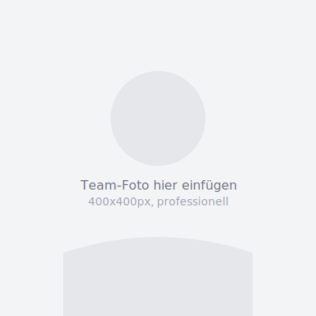

# 📸 Bilder zur Website hinzufügen

## ✅ Was wurde bereits gemacht?

- ✅ Professionelle SVG-Icons erstellt (keine Emojis mehr!)
- ✅ Platzhalter für Team-Fotos eingefügt
- ✅ Seriöses, professionelles Design
- ✅ Alle Icons sind skalierbar und scharf

---

## 🖼️ Benötigte Bilder

### 1. TEAM-FOTO (Wichtig!)

**Wo:** `ueber-uns.html`
**Aktuell:** `assets/images/placeholder-team.svg`
**Ersetzen durch:** `assets/images/team-ibrahim-erben.jpg`

**Anforderungen:**
- Größe: 400x400px (quadratisch)
- Format: JPG oder PNG
- Stil: Professionelles Portrait
- Business-Outfit
- Gute Beleuchtung
- Neutraler oder unscharfer Hintergrund

**So fügen Sie es ein:**

1. Speichern Sie Ihr Foto als `team-ibrahim-erben.jpg`
2. Kopieren Sie es in den Ordner: `assets/images/`
3. Öffnen Sie `ueber-uns.html` mit Texteditor
4. Suchen Sie nach: `placeholder-team.svg`
5. Ersetzen Sie durch: `team-ibrahim-erben.jpg`
6. Speichern und Browser aktualisieren

**Beispiel:**

Vorher:
```html

```

Nachher:
```html

```

---

### 2. HERO-HINTERGRUNDBILD (Optional)

**Wo:** `index.html` - Hero-Section (ganz oben)
**Aktuell:** Farbverlauf (Dunkelblau)
**Optional:** Hintergrundbild einfügen

**Anforderungen:**
- Größe: 1920x1080px (Full HD)
- Format: JPG (optimiert, max. 300KB)
- Motiv: Professionelles Büro, Düren Stadtansicht, oder abstrakt
- Stil: Hell, freundlich, nicht zu ablenkend

**So fügen Sie es ein:**

1. Speichern Sie Ihr Bild als `hero-background.jpg`
2. Kopieren Sie es in: `assets/images/`
3. Öffnen Sie `assets/css/styles.css` mit Texteditor
4. Suchen Sie nach: `.hero {`
5. Fügen Sie hinzu:
   ```css
   .hero {
     background-image: url('../images/hero-background.jpg');
     background-size: cover;
     background-position: center;
   }
   ```
6. Speichern und Browser aktualisieren

**Tipp:** Weniger ist mehr! Ein zu buntes Hintergrundbild kann vom Text ablenken.

---

### 3. LEISTUNGS-BILDER (Optional, für spätere Verbesserung)

**Wo:** `leistungen.html` - Bei jeder Leistungs-Kategorie
**Aktuell:** Keine Bilder (nur Icons)

Falls Sie später Bilder hinzufügen möchten:

- `wegzug.jpg` - Internationales Thema (z.B. Flugzeug, Weltkarte)
- `ecommerce.jpg` - Online-Handel (z.B. Laptop mit Webshop)
- `heilberufe.jpg` - Medizin (z.B. Arztpraxis)
- `immobilien.jpg` - Gebäude (z.B. modernes Bürogebäude)
- `nachfolge.jpg` - Generationen (z.B. Handshake)

**Größe:** 800x600px
**Format:** JPG (optimiert)

**So fügen Sie sie ein:**

1. Öffnen Sie `leistungen.html`
2. Suchen Sie die gewünschte Kategorie (z.B. `<div class="service-detail__category" id="wegzug">`)
3. Fügen Sie nach dem `<h2>`-Tag ein:
   ```html
   <div class="image-wrapper" style="margin-bottom: 1.5rem;">
       
   </div>
   ```
4. Wiederholen Sie für andere Kategorien
5. Speichern und Browser aktualisieren

---

### 4. STANDORT-FOTO (Optional)

**Wo:** `ueber-uns.html` - Standort-Section
**Motiv:** Kanzlei-Gebäude von außen oder Empfangsbereich

**Anforderungen:**
- Größe: 1200x800px
- Format: JPG
- Stil: Einladend, professionell

**So fügen Sie es ein:**

1. Speichern Sie als `standort-dueren.jpg` in `assets/images/`
2. Öffnen Sie `ueber-uns.html`
3. Suchen Sie nach der Karten-Sektion (Google Maps)
4. Fügen Sie VOR der Karte ein:
   ```html
   <div class="image-wrapper" style="margin-bottom: 2rem;">
       
   </div>
   ```
5. Speichern und Browser aktualisieren

---

## 🎨 LIZENZFREIE BILDQUELLEN (kostenlos)

### Empfohlene Plattformen:

1. **Unsplash.com**
   - Hochwertige, professionelle Bilder
   - 100% kostenlos
   - Keine Registrierung nötig
   - Suchbegriffe: "professional office", "business meeting", "accountant"

2. **Pexels.com**
   - Große Auswahl
   - Kostenlos
   - Einfach zu durchsuchen

3. **Pixabay.com**
   - Viele Business-Motive
   - Kostenlos

### Suchbegriffe (englisch):

- `professional office modern`
- `business meeting handshake`
- `accountant workspace`
- `modern office building exterior`
- `business portrait professional`
- `tax advisor office` (weniger Ergebnisse, aber passender)

### Wichtig:

- ✅ Immer die Lizenz prüfen
- ✅ Bei manchen Plattformen Fotografen nennen (freiwillig, aber fair)
- ❌ Keine Bilder von Google verwenden (oft urheberrechtlich geschützt)

---

## 🔧 BILDER OPTIMIEREN (Wichtig für Ladezeit!)

### Vor dem Hochladen:

Bilder müssen komprimiert werden, damit die Website schnell bleibt.

**Online-Tools (kostenlos):**

1. **TinyPNG.com** oder **TinyJPG.com**
   - Drag & Drop
   - Komprimiert ohne sichtbaren Qualitätsverlust
   - Reduziert Dateigröße um 50-70%

2. **Squoosh.app** (von Google)
   - Sehr leistungsstark
   - Zeigt Vorschau

**Zielgrößen:**
- Team-Foto (400x400px): max. 100KB
- Hero-Hintergrund (1920x1080px): max. 300KB
- Leistungs-Bilder (800x600px): max. 150KB

**Warum?**
- Schnellere Ladezeit = besseres Google-Ranking
- Bessere Nutzererfahrung auf Smartphone
- Weniger Datenverbrauch für Besucher

---

## 📐 BILDGRÖ

SSE ANPASSEN

Falls Ihre Bilder nicht die richtige Größe haben:

### Online (kostenlos):

1. **ILoveIMG.com/resize-image**
   - Drag & Drop
   - Größe eingeben
   - Herunterladen

2. **Photopea.com** (kostenlos, wie Photoshop)
   - Im Browser
   - Professionell
   - "Image" → "Image Size"

### Mac (integriert):

1. Bild öffnen mit "Vorschau"
2. "Werkzeuge" → "Größe anpassen"
3. Gewünschte Größe eingeben (z.B. 400x400)
4. Speichern

### Windows (integriert):

1. Rechtsklick auf Bild
2. "Öffnen mit" → "Paint"
3. "Größe ändern"
4. Gewünschte Größe eingeben
5. Speichern unter

---

## ✅ CHECKLISTE BILDER

Bevor Sie die Website veröffentlichen:

- [ ] Team-Foto eingefügt (400x400px, < 100KB)
- [ ] Alt-Texte bei allen Bildern gesetzt
- [ ] Bilder komprimiert (TinyPNG oder Squoosh)
- [ ] Bilder auf Desktop getestet
- [ ] Bilder auf Smartphone getestet
- [ ] Ladezeit geprüft (sollte < 2 Sekunden sein)

---

## 💡 TIPPS FÜR GUTE FOTOS

### Team-Foto:

✅ **DO:**
- Professionelles Business-Outfit
- Freundlicher Gesichtsausdruck
- Blickkontakt zur Kamera
- Tageslicht oder gute Beleuchtung
- Neutraler Hintergrund (weiß, grau, unscharf)

❌ **DON'T:**
- Selfie-Stil
- Zu casual (T-Shirt, Hoodie)
- Schlechte Beleuchtung
- Ablenkender Hintergrund
- Verpixelt oder unscharf

### Standort-Foto:

✅ **DO:**
- Bei gutem Wetter fotografieren
- Gebäude komplett im Bild
- Keine parkenden Autos davor
- Perspektive auf Augenhöhe

---

## 🆘 PROBLEME?

### Bild wird nicht angezeigt?

1. **Dateiname prüfen:**
   - Groß-/Kleinschreibung beachten!
   - `team-ibrahim-erben.jpg` ≠ `Team-Ibrahim-Erben.jpg`

2. **Pfad prüfen:**
   - Bild muss in `assets/images/` liegen
   - HTML-Code: `src="assets/images/bildname.jpg"`

3. **Browser-Cache leeren:**
   - Strg+Shift+R (Windows)
   - Cmd+Shift+R (Mac)
   - Oder im Inkognito-Modus testen

### Bild ist unscharf?

- Zu kleine Auflösung
- Zu stark komprimiert
- Originalauflösung verwenden

### Bild lädt zu langsam?

- Datei ist zu groß
- Mit TinyPNG komprimieren
- Zielgröße: max. 300KB pro Bild

---

## 🎉 FERTIG!

Ihre Website sieht jetzt professionell aus mit:
- ✅ Seriösen SVG-Icons (keine Emojis)
- ✅ Professionellen Bildern (sobald eingefügt)
- ✅ Schnellen Ladezeiten
- ✅ Seriösem Kanzlei-Look

**Nächste Schritte:**
1. Team-Foto einfügen
2. Optional: Hero-Hintergrund & Leistungs-Bilder
3. Website veröffentlichen!

Bei Fragen: Siehe README.md für weitere Details.
